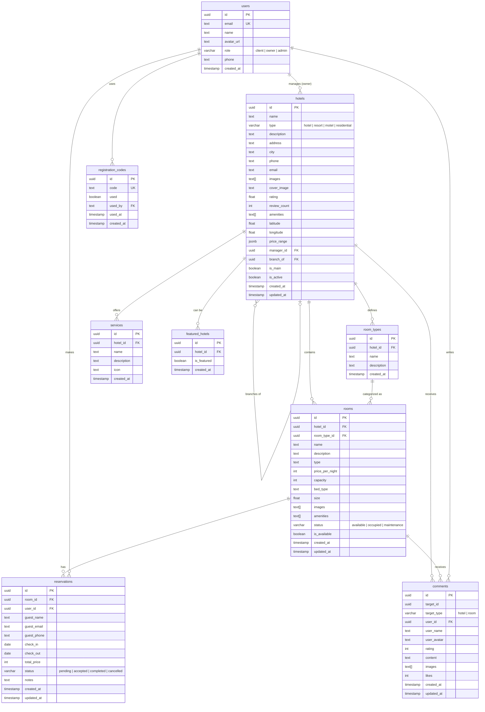

# Diagrama Entidad-Relacion (ERD) — Tourist Corner

## Tablas de Supabase

## Descripcion de Tablas

### users

Almacena los usuarios del sistema con su rol (`client`, `owner`, `admin`). Vinculada con Supabase Auth.

### hotels

Propiedades hoteleras. Soporta sucursales mediante `branchOf` (autorelacion). `isMain` indica si es la sucursal principal.

### room_types

Tipos de habitacion definidos por cada hotel (ej: "Suite Deluxe", "Habitacion Estandar").

### services

Servicios adicionales del hotel (ej: "Spa", "Lavanderia").

### rooms

Habitaciones individuales dentro de un hotel. `status` indica disponibilidad operativa, `isAvailable` indica si se puede reservar.

### reservations

Solicitudes de reserva con flujo de estados: `pending → accepted → completed` o `pending → cancelled`.

### comments

Opiniones y calificaciones (1-5 estrellas) sobre hoteles o habitaciones.

### registration_codes

Codigos de invitacion requeridos para registro como `owner`. Generados por el admin.

### featured_hotels

Hoteles destacados mostrados en la pagina principal. Gestionados por el admin.

## Reglas de Integridad (RLS)

- **users**: Solo el propio usuario puede leer/editar su perfil. Admin puede ver todos.
- **hotels**: Owner solo ve sus hoteles. Admin y clientes ven todos los activos.
- **rooms**: Owner ve rooms de sus hoteles. Clientes ven rooms disponibles.
- **reservations**: Owner ve reservas de sus hoteles. Cliente ve sus propias reservas.
- **comments**: Todos leen. Solo el autor puede editar/eliminar su comentario.
- **registration_codes**: Solo admin puede crear y gestionar.
- **featured_hotels**: Solo admin puede gestionar.
