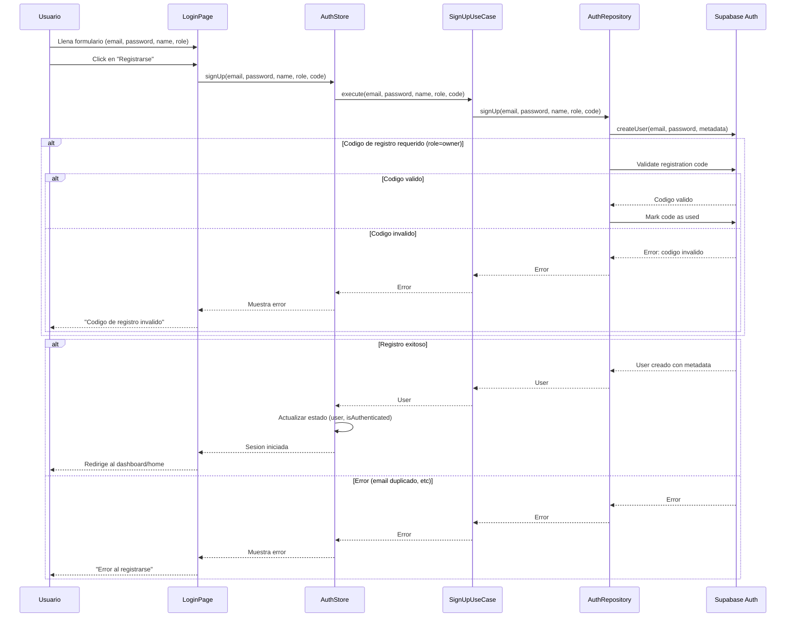
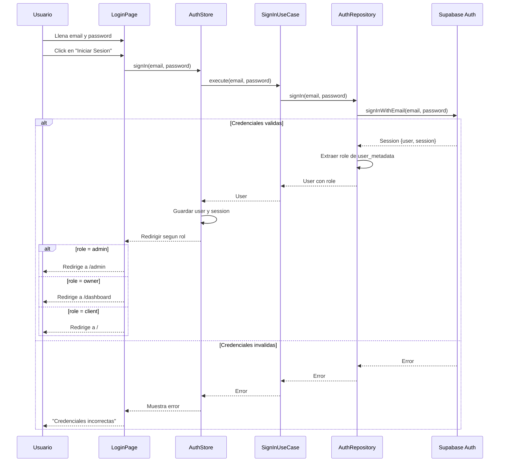
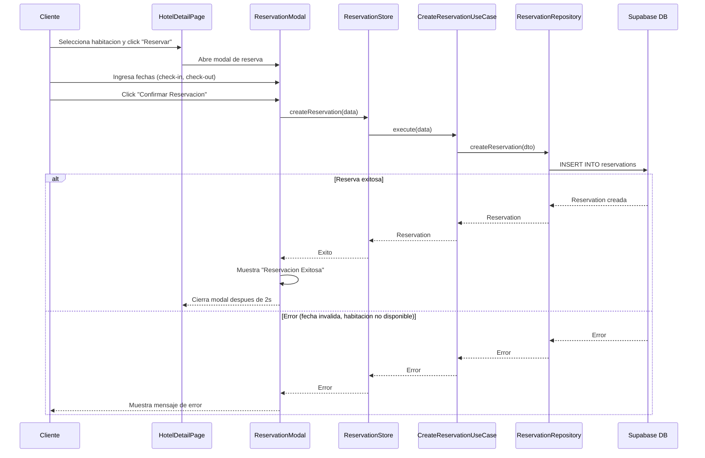
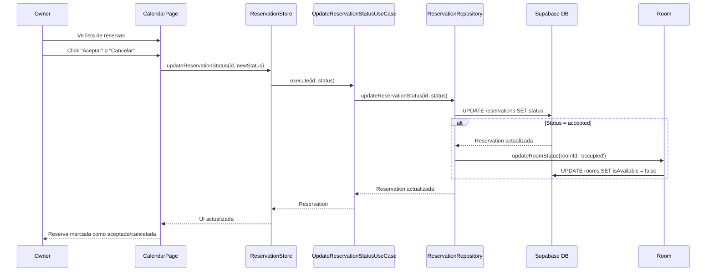
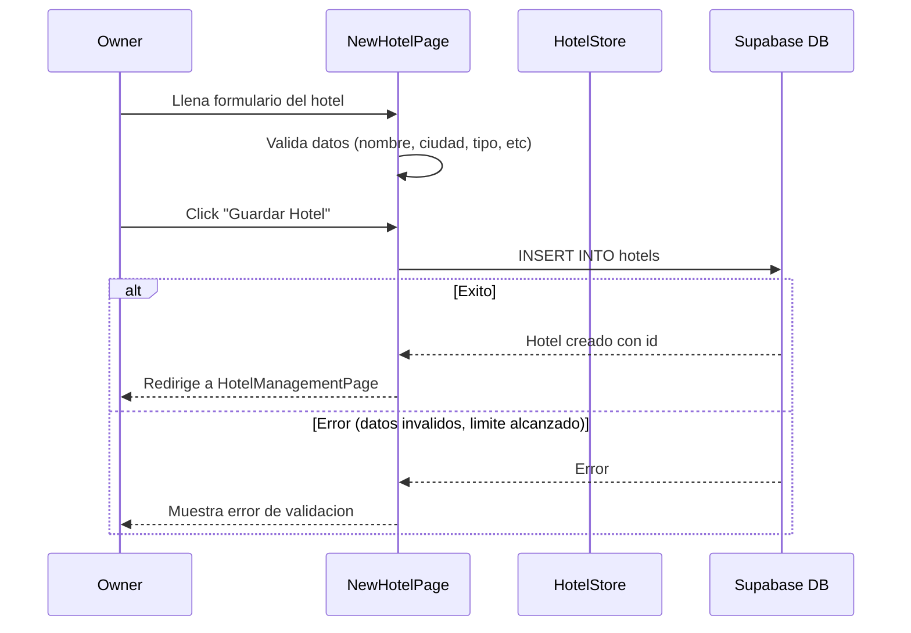
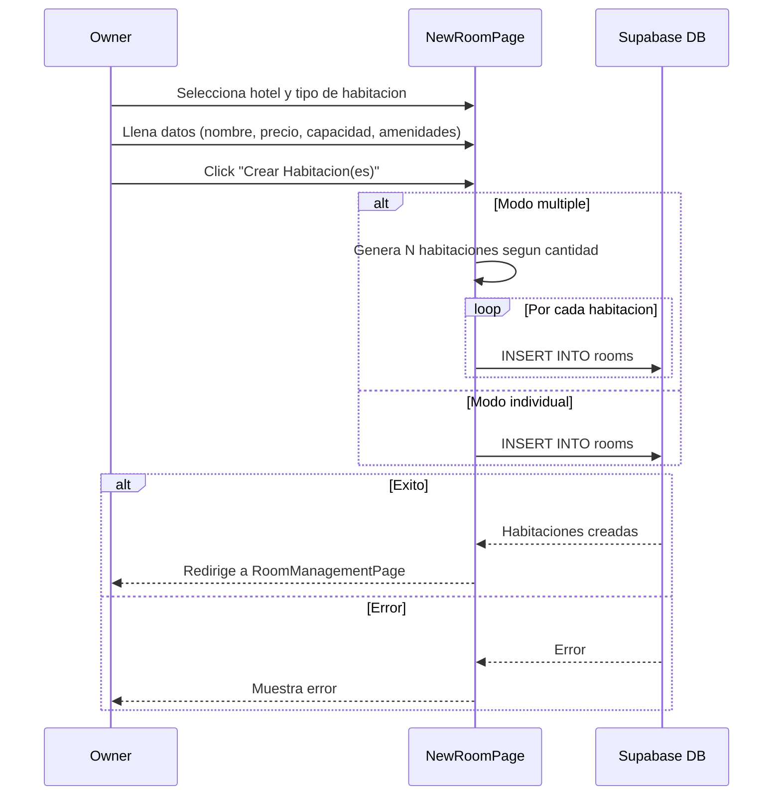
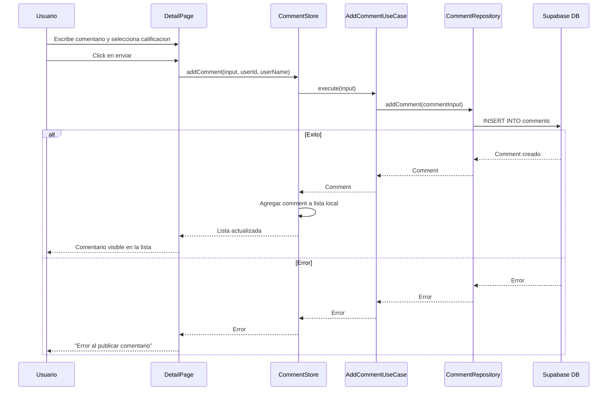

# Diagramas de Secuencia — Tourist Corner

---

## 1. Registro de Usuario

---

## 2. Inicio de Sesion

---

## 3. Reserva de Habitacion

---

## 4. Aceptacion/Cancelacion de Reserva (Owner)

---

## 5. Creacion de Hotel (Owner)

---

## 6. Gestion de Habitaciones (Owner)

---

## 7. Comentario en Hotel/Room

