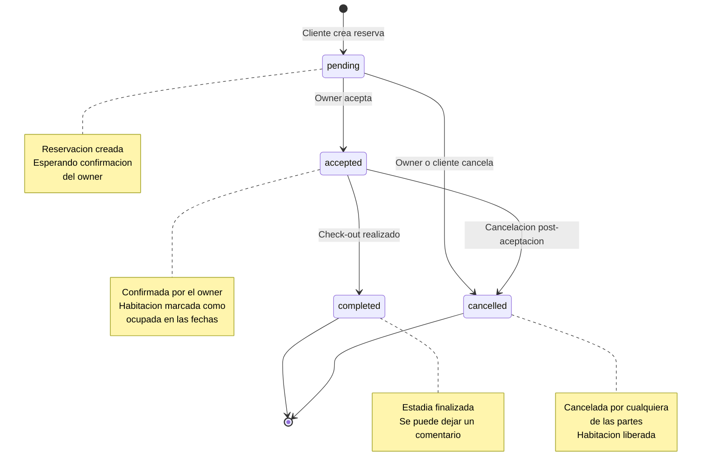
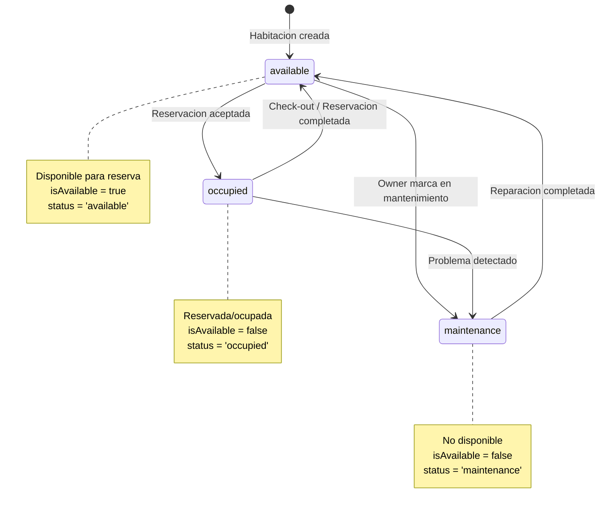
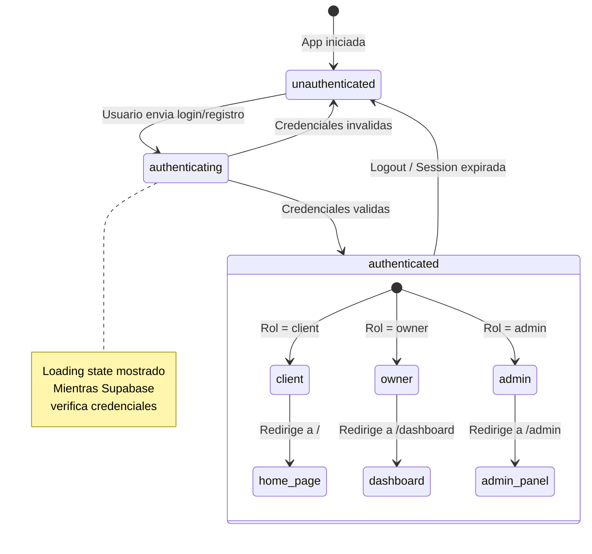
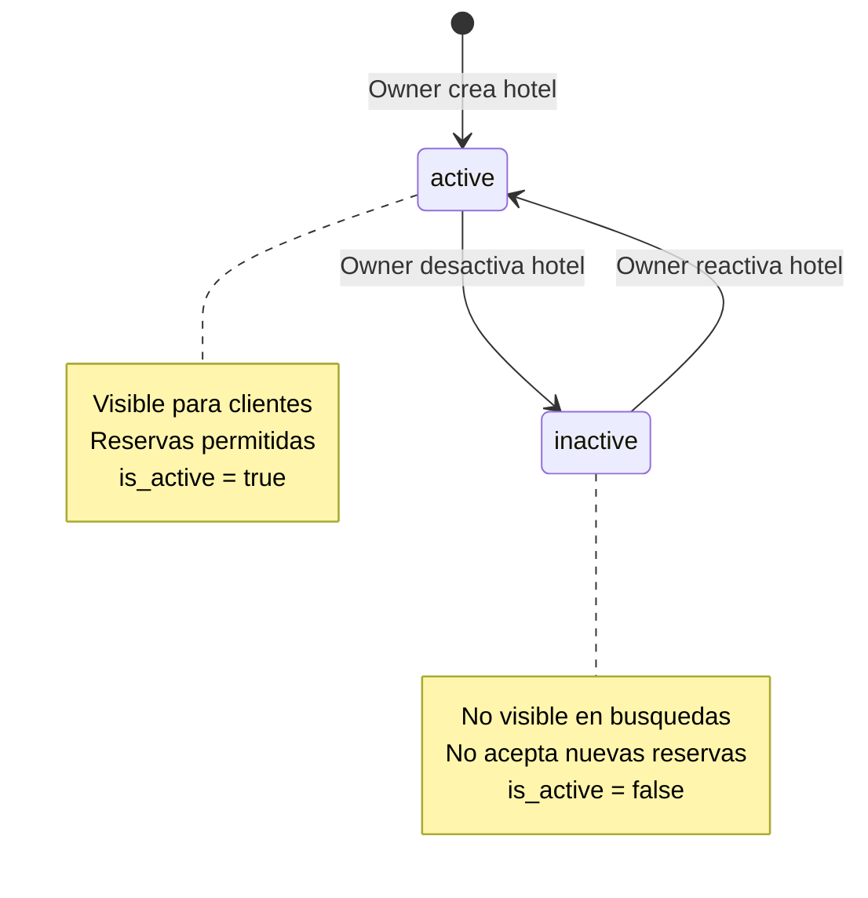
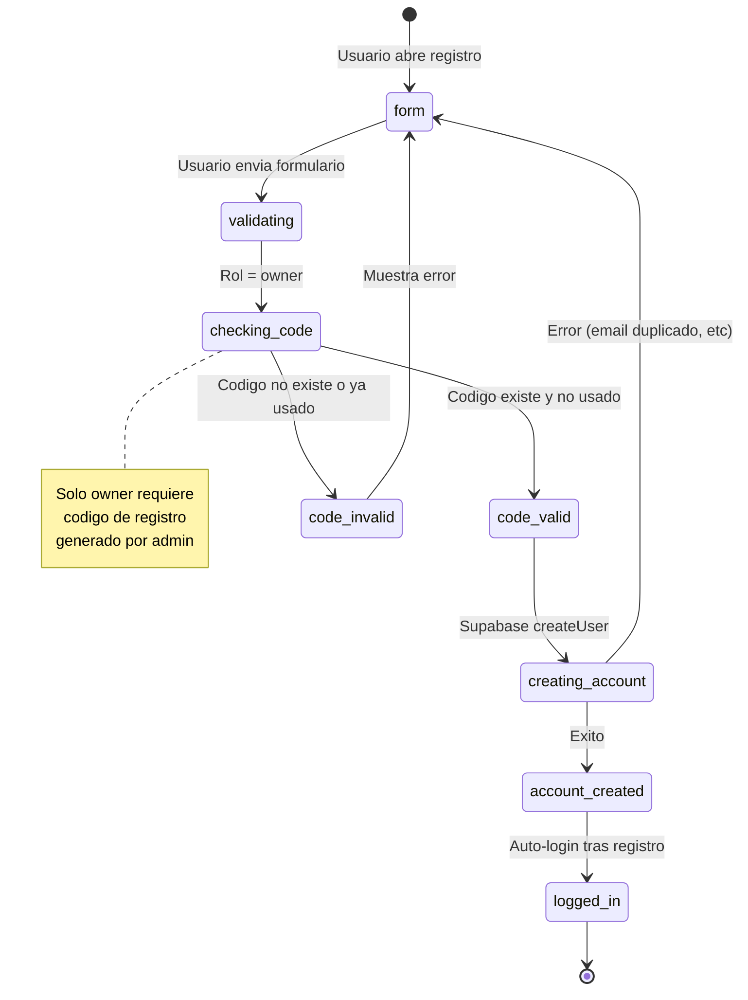
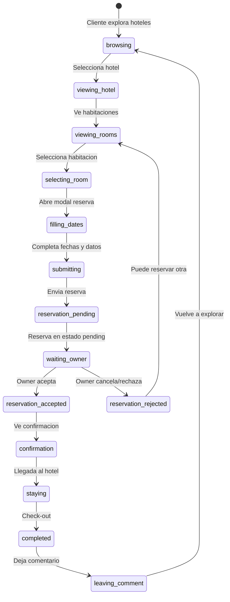

# Diagramas de Estado — Tourist Corner

---

## 1. Estado de Reservacion

---

## 2. Estado de Habitacion (Room)

---

## 3. Estado de Autenticacion del Usuario

---

## 4. Estado de Hotel

---

## 5. Flujo de Registro (Owner)

---

## 6. Flujo de Reserva Completa

