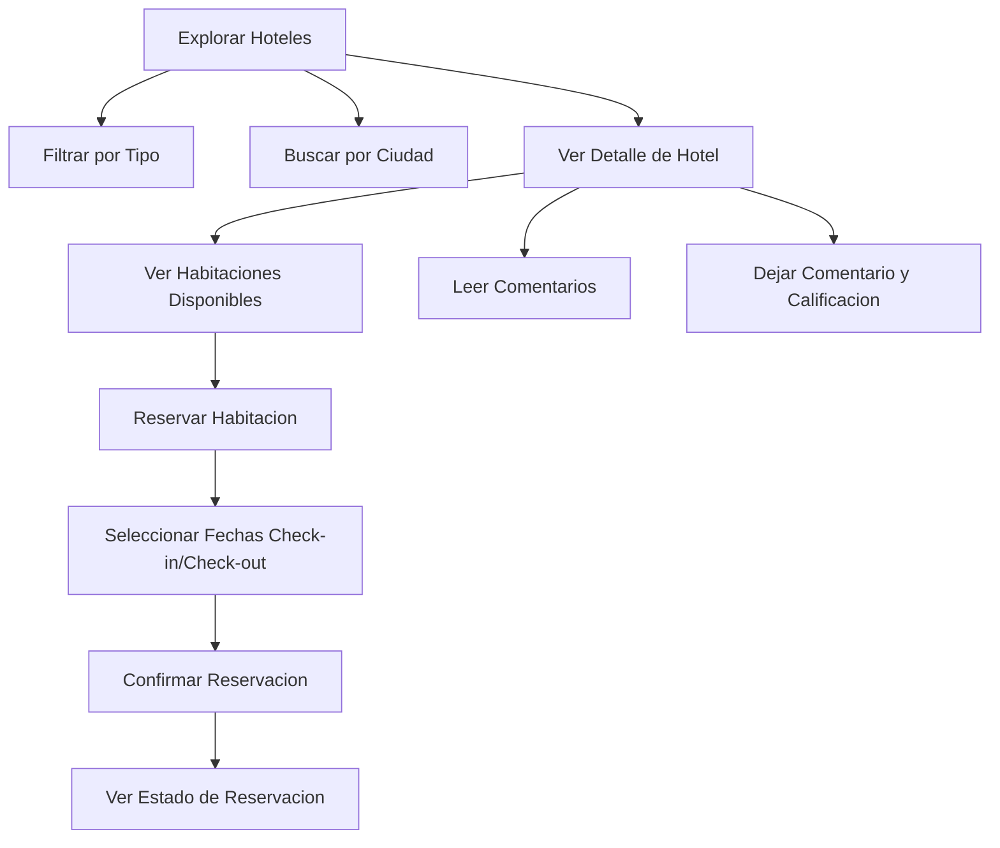
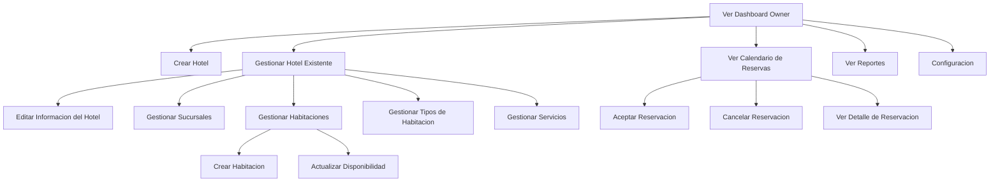
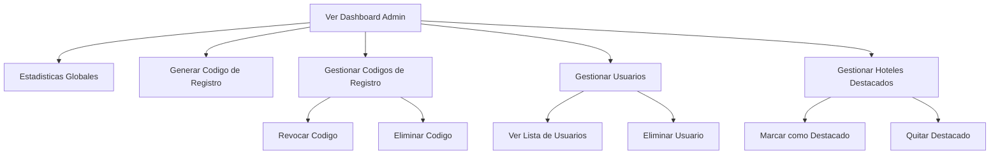

# Diagrama de Casos de Uso — Tourist Corner

## Actores del Sistema

| Actor | Descripcion |
| --- | --- |
| **Cliente** | Usuario que busca hoteles, reserva habitaciones y deja comentarios |
| **Owner** | Dueno de hotel que gestiona propiedades, habitaciones y reservas |
| **Admin** | Administrador de la plataforma que gestiona usuarios, codigos de registro y hoteles destacados |

---

## Casos de Uso por Actor

### Cliente

### Owner

### Admin

---

## Tabla Completa de Casos de Uso

| ID | Caso de Uso | Actor | Precondicion | Postcondicion |
| --- | --- | --- | --- | --- |
| UC-01 | Registrarse | Cliente/Owner | Ninguna | Cuenta creada con rol asignado |
| UC-02 | Iniciar Sesion | Todos | Cuenta registrada | Sesion activa |
| UC-03 | Explorar Hoteles | Todos | Ninguna | Lista de hoteles visible |
| UC-04 | Filtrar/Buscar | Todos | Ninguna | Resultados filtrados |
| UC-05 | Ver Detalle Hotel | Todos | Hotel existe | Info completa visible |
| UC-06 | Reservar Habitacion | Cliente | Sesion iniciada | Reservacion creada (pending) |
| UC-07 | Dejar Comentario | Todos | Sesion iniciada | Comentario publicado |
| UC-08 | Crear Hotel | Owner | Sesion iniciada, hotel creado | Hotel registrado |
| UC-09 | Gestionar Habitaciones | Owner | Hotel existe | Habitaciones actualizadas |
| UC-10 | Aceptar Reservacion | Owner | Reservacion pending | Status = accepted |
| UC-11 | Cancelar Reservacion | Owner/Cliente | Reservacion existe | Status = cancelled |
| UC-12 | Ver Calendario | Owner | Sesion iniciada | Vista calendario |
| UC-13 | Generar Codigo Registro | Admin | Sesion admin | Codigo creado |
| UC-14 | Gestionar Usuarios | Admin | Sesion admin | Lista usuarios visible |
| UC-15 | Gestionar Destacados | Admin | Sesion admin | Hotel destacado actualizado |
