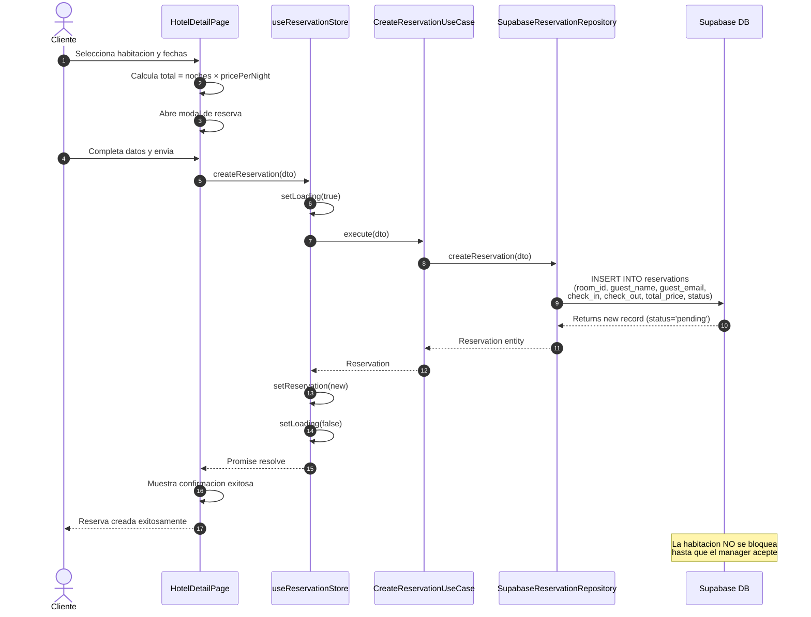

# Flujo de Creacion de Reservacion

## Diagrama de Secuencia

## Notas

- `total_price` se envia como 0 (GAP: debe calcularse automaticamente)
- `user_id` se envia si el usuario esta autenticado
- No hay validacion de disponibilidad (GAP: debe verificar overlapping de fechas)
- La reserva queda en estado `pending` hasta que el manager la acepte
