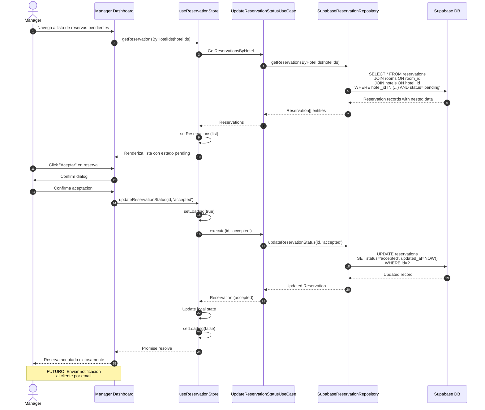

# Flujo de Aceptacion de Reservacion

## Diagrama de Secuencia

## Notas

- Solo el manager del hotel puede aceptar reservas
- La reserva pasa de `pending` a `accepted`
- No se bloquea la habitacion al aceptar (GAP: deberia marcar disponibilidad)
- FUTURO: Notificacion automatica al cliente cuando se acepta
