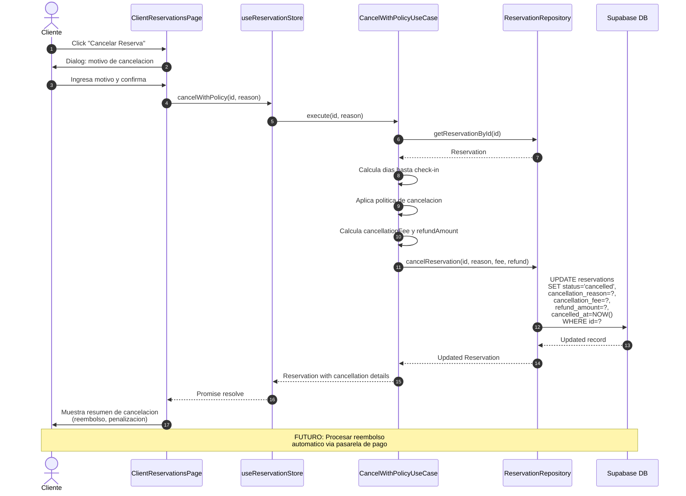

# Flujo de Cancelacion de Reservacion

## Diagrama de Secuencia

```mermaid
sequenceDiagram
    autonumber
    actor Actor as Cliente o Manager
    participant UI as UI (ClientReservations/Manager)
    participant Store as useReservationStore
    participant UC as CancelReservationUseCase
    participant Repo as SupabaseReservationRepository
    participant DB as Supabase DB
    
    Actor->>UI: Click "Cancelar Reserva"
    UI->>Actor: Confirm dialog + reason (FUTURO)
    
    Actor->>UI: Confirma cancelacion
    UI->>Store: cancelReservation(id)
    Store->>Store: setLoading(true)
    
    Store->>UC: execute(id)
    UC->>Repo: cancelReservation(id)
    Repo->>Repo: updateReservationStatus(id, 'cancelled')
    Repo->>DB: UPDATE reservations<br/>SET status='cancelled', updated_at=NOW()<br/>WHERE id=?
    DB-->>Repo: Updated record
    Repo-->>UC: Updated Reservation
    UC-->>Store: Reservation (cancelled)
    Store->>Store: Update local state
    Store->>Store: setLoading(false)
    Store-->>UI: Promise resolve
    UI-->>Actor: Reserva cancelada exitosamente
    
    Note over Actor,DB: ACTUAL: Sin penalizacion ni calculo<br/>de reembolso — solo cambia estado
```

## Reglas de Cancelacion Actuales

- **Cliente**: Puede cancelar reservas en cualquier estado (pending o accepted)
- **Manager**: Puede cancelar cualquier reserva de sus hoteles
- **Sin penalizacion**: No se calcula ningun fee ni reembolso
- **Sin motivo**: No se registra razon de cancelacion

## Reglas de Cancelacion Futuras (Propuestas)

| Tiempo antes del check-in | Penalizacion | Reembolso |
|---------------------------|--------------|-----------|
| > 7 dias | 0% | 100% |
| 3-7 dias | 50% | 50% |
| < 3 dias | 100% | 0% |
| Ya accepted | 100% | 0% |

### Flujo de cancelacion propuesto


