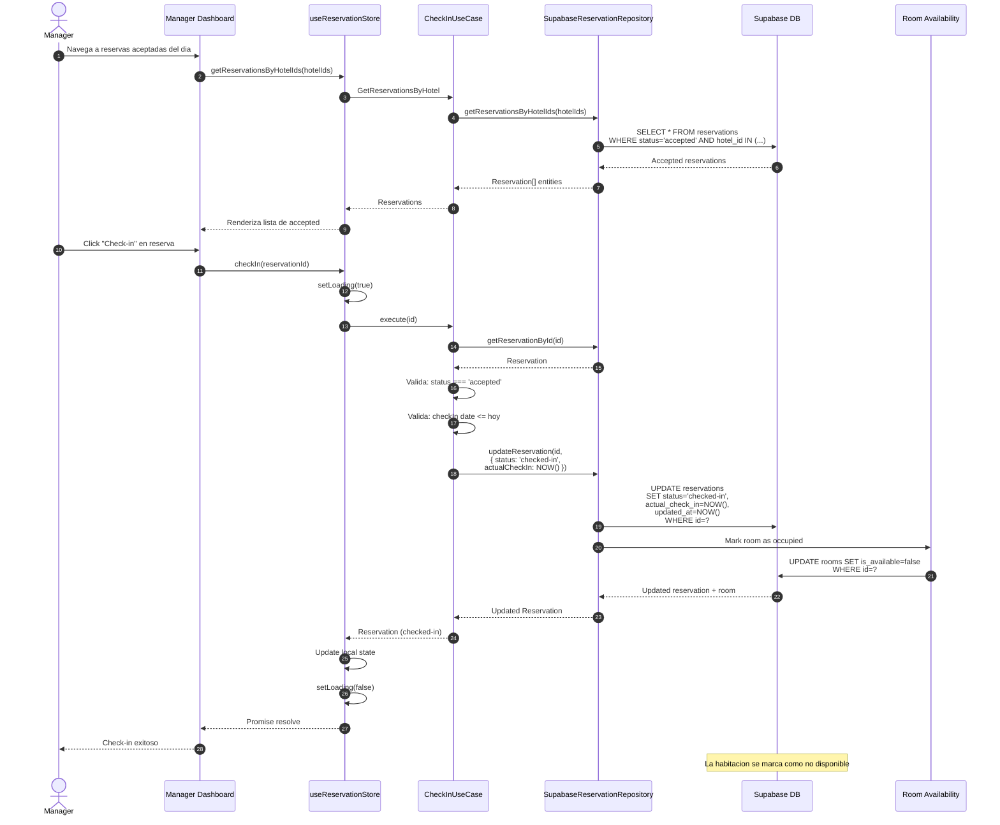

# Flujo de Check-in

## Diagrama de Secuencia



## Notas

- **No implementado actualmente** — estado `checked-in` no existe
- El manager verifica la identidad del huesped antes de hacer check-in
- La habitacion se marca como ocupada (is_available = false)
- FUTURO: Self check-in para clientes desde la app
- FUTURO: Enviar notificacion de confirmacion de check-in al cliente

## Estados relacionados

```
accepted → checked-in → checked-out → completed
```

## Validaciones

- La reserva debe estar en estado `accepted`
- La fecha de check-in planificada debe ser hoy o en el pasado
- La habitacion debe estar disponible
