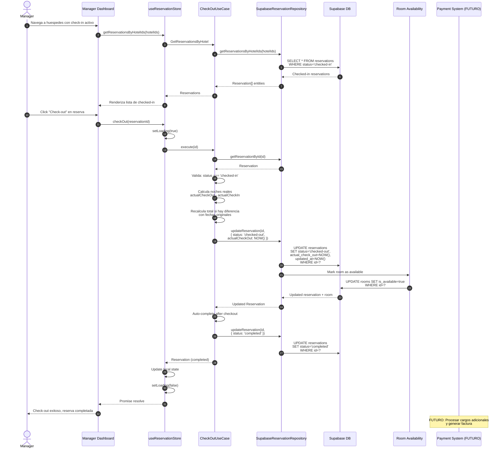

# Flujo de Check-out

## Diagrama de Secuencia



## Notas

- **No implementado actualmente** — se salta directo a `completed` sin registro de check-out
- El manager verifica el estado de la habitacion antes de check-out
- Se recalcula el precio total si las fechas reales difieren de las planificadas
- La habitacion se libera automaticamente (is_available = true)
- Transicion automatica a `completed` despues del check-out
- FUTURO: Procesar cargos adicionales (minibar, room service, etc.)
- FUTURO: Generar factura/recibo para el cliente

## Estados relacionados

```
checked-in → checked-out → completed (automatico)
```

## Validaciones

- La reserva debe estar en estado `checked-in`
- La fecha de check-out debe ser >= fecha de check-in real
- La habitacion debe estar asociada correctamente
