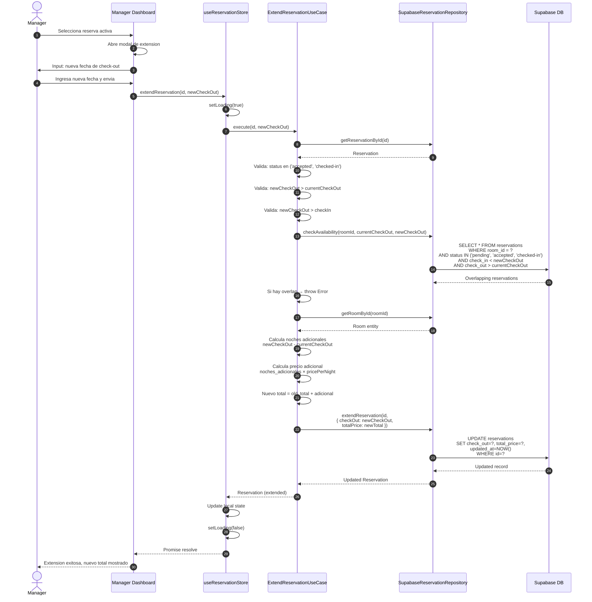

# Flujo de Extension de Reservacion

## Diagrama de Secuencia



## Notas

- **No implementado actualmente** — el cliente tendria que crear otra reserva
- Funciona para reservas en estado `accepted` o `checked-in`
- Valida que no haya conflictos de disponibilidad para las nuevas fechas
- Recalcula el precio total automaticamente
- El estado NO cambia, solo se actualizan las fechas y el precio

## Estados donde aplica

```
accepted → accepted (mismo estado, nuevas fechas)
checked-in → checked-in (mismo estado, nuevas fechas)
```

## Validaciones

- newCheckOut debe ser posterior al checkOut actual
- newCheckOut debe ser posterior al checkIn
- No debe haber reservas overlapping en las fechas extendidas
- La habitacion debe estar disponible para el periodo adicional
