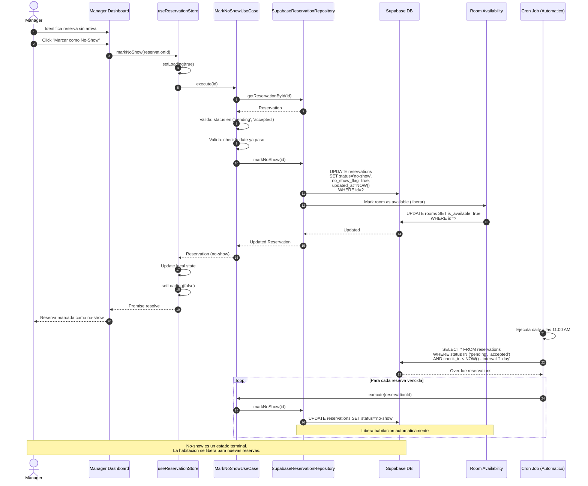

# Flujo de No-Show

## Diagrama de Secuencia



## Notas

- **No implementado actualmente** — las reservas pending/accepted permanecen activas indefinidamente
- Puede ser accion manual del manager o automatica via cron job
- La habitacion se libera automaticamente para que pueda ser reservada
- El registro de no-show puede usarse para scoring de clientes (FUTURO)
- FUTURO: Penalizacion para clientes con multiple no-shows

## Estados donde aplica

```
pending → no-show (terminal)
accepted → no-show (terminal)
```

## Validaciones

- La reserva debe estar en estado `pending` o `accepted`
- La fecha de check-in debe haber pasado (al menos 1 dia)
- La habitacion debe estar vinculada para poder liberarla

## Cron Job Propuesto

| Campo | Valor |
|-------|-------|
| Schedule | Daily 11:00 AM |
| Target | Reservas con check_in < ayer |
| Action | Marcar como no-show, liberar habitacion |
| Log | Registrar en reservation_status_history |
