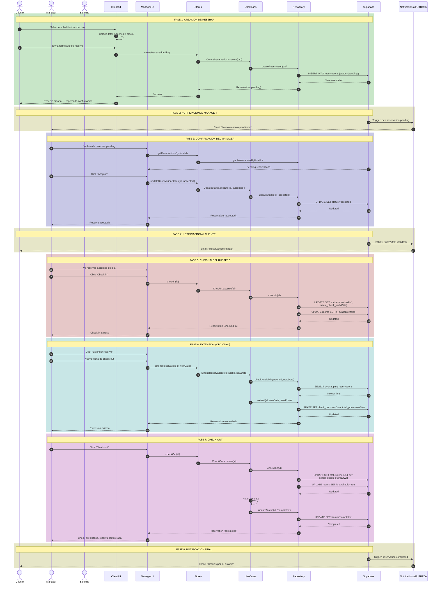

# Flujo Completo de Reservacion — End-to-End

## Diagrama de Secuencia Completo



## Resumen de Estados en el Flujo Completo

| Fase | Estado | Actor | Accion |
|------|--------|-------|--------|
| 1 | `pending` | Client | Crea reserva |
| 3 | `accepted` | Manager | Acepta reserva |
| 5 | `checked-in` | Manager | Registra llegada |
| 6 | `accepted` o `checked-in` | Manager | Extiende (opcional) |
| 7 | `checked-out` → `completed` | Manager | Registra salida |

## Flujos Alternativos

### A: Cancelacion por Cliente
```
pending → cancelled (cliente cancela antes de aceptacion)
accepted → cancelled (cliente cancela despues de aceptacion, con penalizacion)
```

### B: No-Show
```
pending → no-show (cliente nunca llego, fecha paso)
accepted → no-show (cliente nunca llego, fecha paso)
```

### C: Cancelacion por Manager
```
pending → cancelled (manager rechaza reserva)
accepted → cancelled (manager cancela por fuerza mayor)
```
